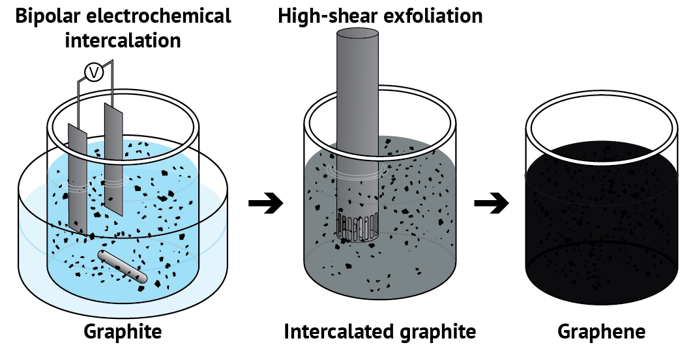
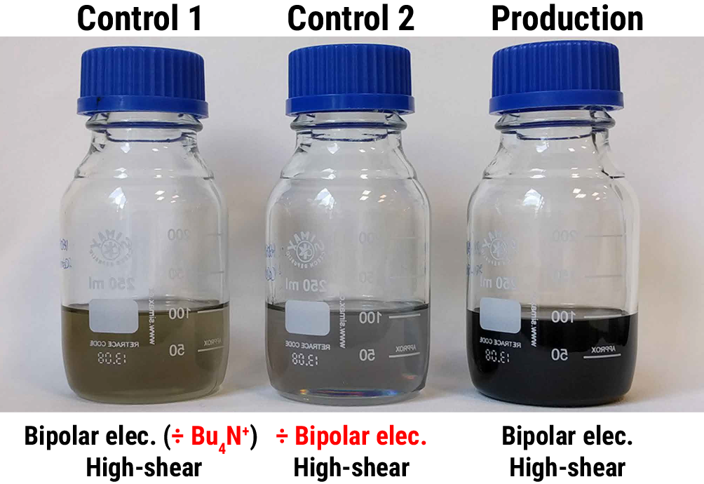
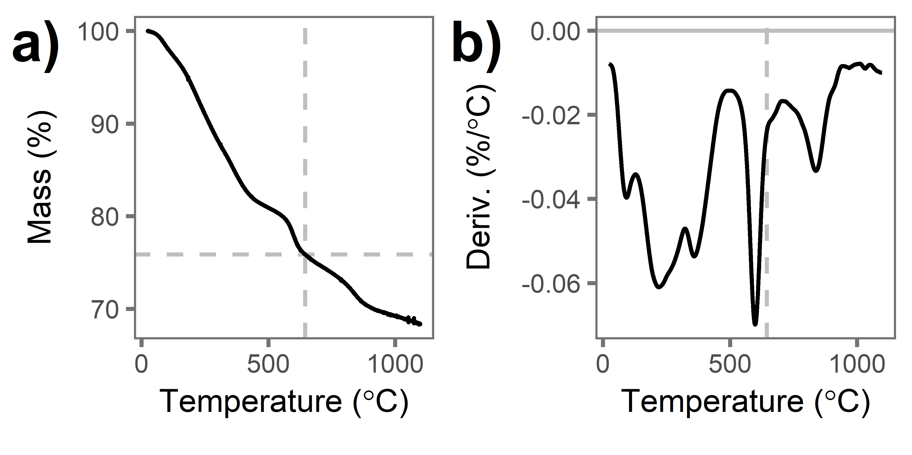
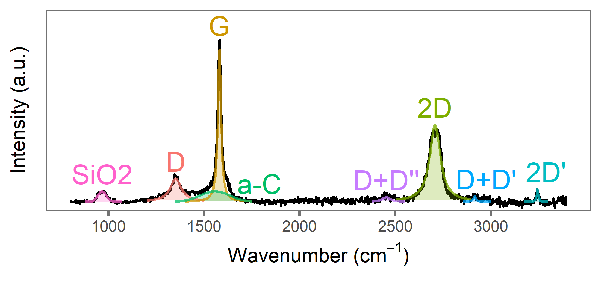
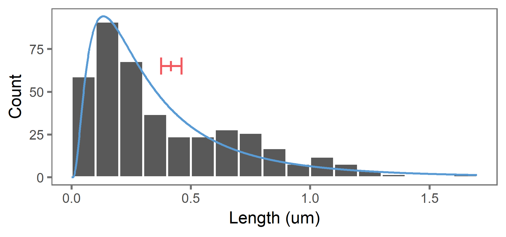
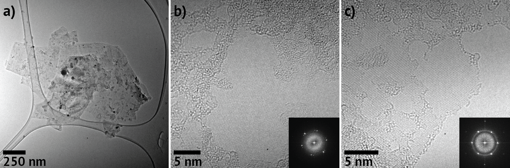
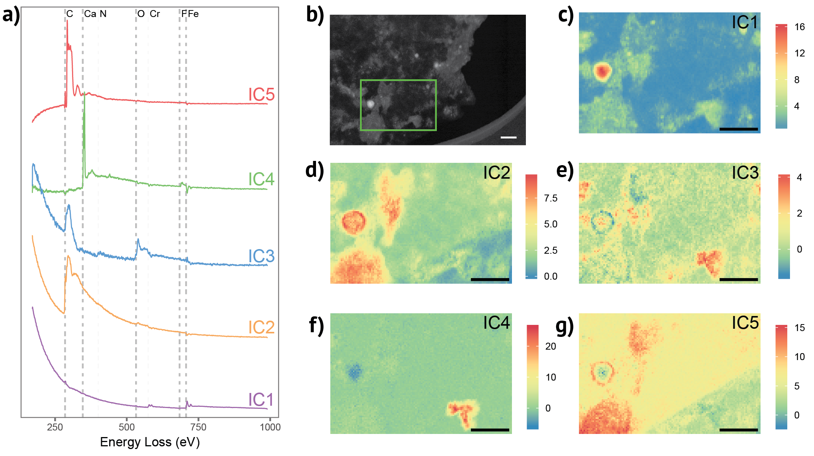
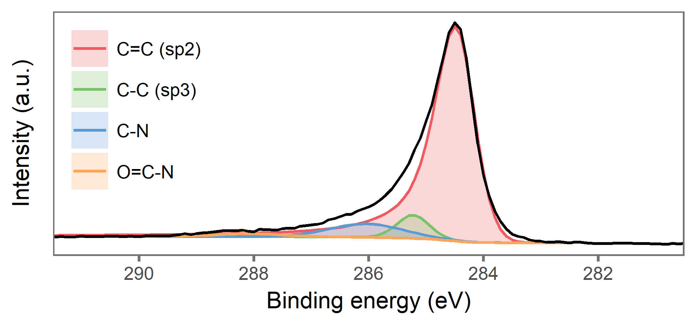

```{r setup, include=FALSE}
knitr::opts_chunk$set(echo = FALSE)
```

## Acknowledgements
<div class="columns-2">
<br><br>
</div>
<div class="columns-2">
**Aarhus University, Denmark**

* Prof. Kim Daasbjerg
* Ass. Prof. Steen Uttrup Pedersen
* The Organic Surface Chemistry group

**McMaster University, Canada**

* Gianluigi Botton
* Samantha Stambula
</div>

## Bulk graphene production

### High shear exfoliation

Used by Coleman.. Earlier..

### Bipolar electrochemistry

What is it, and why do we want to use it

## Combined high-shear exfoliation and bipolar electrochemistry
<div style="text-align: center;margin-bottom: 15px;"></div>

1. Bipolar electrochemical intercalation of Bu~4~NBF~4~ using stainless steel electrodes at 1100 V (1 cm apart)
2. High-shear exfoliation at 6000 rpm for 1 hour.


---

<div style="text-align: center;margin-bottom: 15px;"></div>
<div id="control">
a) Bipolar electrochemistry + high-shear exfoliation
b) High-shear exfoliation
c) Bipolar electrochemistry (without Bu~4~NBF~4~) + High-shear exfoliation
</div>

## Thermogravimetric analysis
<div style="text-align: center;margin-bottom: 15px;"></div>


## Raman spectroscopy
<div style="text-align: center;margin-bottom: 15px;"></div>

## Flake sizes
<div style="text-align: center;margin-bottom: 15px;"></div>

## Transmission Electron Microscopy
<div style="text-align: center;margin-bottom: 15px;"></div>

## STEM-EELS

<video style="width:100%;" controls autoplay>
  <source src="video/graphene_hyperspy.mp4" type="video/mp4">
</video>

## STEM-EELS

<div style="text-align: center;margin-bottom: 15px;"></div>

## XPS (might not include)
<div style="text-align: center;margin-bottom: 15px;"></div>

## Conclusions
