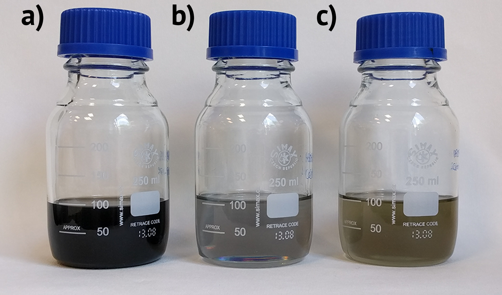

```{r setup, include=FALSE}
knitr::opts_chunk$set(echo = FALSE)
```

## Acknowledgements
<div class="columns-2">
<center></center>
<br />
**Aarhus University, Denmark**

* Prof. Kim Daasbjerg
* Ass. Prof. Steen Uttrup Pedersen
* The Organic Surface Chemistry group


<center></center>

<br />
**McMaster University, Canada**

* Gianluigi Botton
* Samantha Stambula


</div>

## Bulk graphene production

### High shear exfoliation

Used by Coleman.. Earlier..

### Bipolar electrochemistry

What is it, and why do we want to use it

## Combined high-shear exfoliation and bipolar electrochemistry


### Method description

## Initial results


Yield

## Raman spectroscopy

## Flake sizes

## Transmission Electron Microscopy

## STEM-EELS

## XPS (might not include)

## Conclusions
