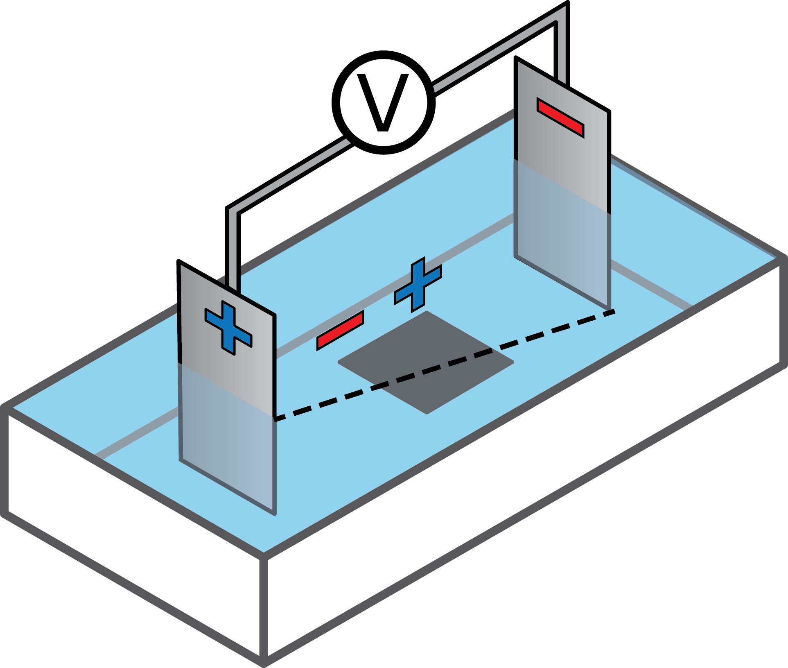
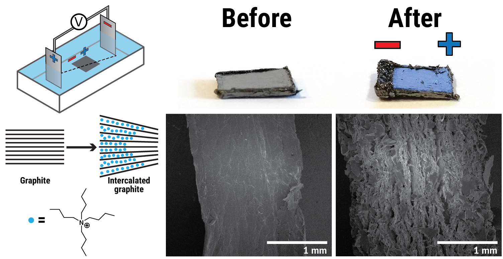

```{r setup, include=FALSE}
knitr::opts_chunk$set(echo = FALSE)
```

<script src="https://use.fontawesome.com/c538300e85.js"></script>
<script src="https://ajax.googleapis.com/ajax/libs/jquery/3.1.1/jquery.min.js"></script>

<script>
  $(document).ready(function() {
    $('slide:not(.backdrop):not(.title-slide)').append('<div class=\"footnotes\">');

    $('footnote').each(function(index) {
      var text  = $(this).html();
      var fnNum = (index+1).toString();
      $(this).html(fnNum.sup());

      var footnote   = fnNum + '. ' + text + '<br/>';
      var oldContent = $(this).parents('slide').children('div.footnotes').html();
      var newContent = oldContent + footnote;
      $(this).parents('slide').children('div.footnotes').html(newContent);
    });
  
    $("#authorfield").html("<i class='fa fa-fw fa-user' aria-hidden='true'></i> Emil Tveden Bjerglund<br><i class='fa fa-fw fa-graduation-cap' aria-hidden='true'></i> PhD-student<br><i class='fa fa-fw fa-university' aria-hidden='true'></i> Aarhus University");
    $("#datefield").html("<i class='fa fa-fw fa-calendar' aria-hidden='true'></i>");
  });
</script>

## Acknowledgements
<div class="columns-2"><div style="text-align:center;"></div>
<br>
<div style="text-align:center;"></div></div>
<div class="columns-2">
**Aarhus University, Denmark**

* Prof. Kim Daasbjerg
* Ass. Prof. Steen Uttrup Pedersen
* M.Sc. Michael Kristensen

**McMaster University, Canada**

* Prof. Gianluigi Botton
* PhD-student Samantha Stambula
</div>

<br><br>
Slides: [emiltb.github.io/CBH2017/](https://emiltb.github.io/CBH2017/)

## Motivation: Bulk graphene production

<div class="columns-2" style="margin-top: -50px;">
Polymer composites<footnote>Source: [Composites Manufacturing](http://compositesmanufacturingmagazine.com/2014/12/virtual-lab-tests-clay-polymer-composite-properties/)</footnote>
<div style="text-align:center"></div>

Printable electronics<footnote>Source: Ref. Marks paper</footnote>
<div style="text-align:center"></div>

</div>

### High shear exfoliation<footnote>*Nature Materials*, **2014**, *13*, 624---630. [10.1038/nmat3944](http://doi.org/10.1038/nmat3944)</footnote>
<div style="text-align:center"></div>


## Bipolar electrochemistry

<div style="text-align: center;margin-bottom: 15px;"></div>

## Bipolar electrochemistry | Our previous work
<div class="columns-2" style="margin-top:-50px;">
One-step preparation of bifunctionalized surfaces.<footnote>*RSC Advances*, **2016**, *6*, 3882---3887. [10.1039/C5RA20156J](http://doi.org/10.1039/C5RA20156J)</footnote>
<div style="text-align:center"></div>

<br><br><br>
Parallel functionalisation of graphene arrays.<footnote>*Langmuir*, **2016**, *32*, 6289---6296. [10.1021/acs.langmuir.6b01309](http://doi.org/10.1021/acs.langmuir.6b01309)</footnote>

<div style="text-align:center;"></div>

</div>

## Bipolar electrochemistry | Graphite intercalation
<div style="text-align:center;margin-top:-50px;"></div>

## Combined high-shear exfoliation and bipolar electrochemistry
<div style="text-align: center;margin-bottom: 15px;"></div>

1. Bipolar electrochemical intercalation of Bu~4~NBF~4~ using stainless steel electrodes at 1100 V (1 cm apart)
2. High-shear exfoliation at 6000 rpm for 1 hour.


---

<div style="text-align: center;margin-bottom: 15px;"></div>
<div id="control">
a) Bipolar electrochemistry + high-shear exfoliation
b) High-shear exfoliation
c) Bipolar electrochemistry (without Bu~4~NBF~4~) + High-shear exfoliation
</div>

## Thermogravimetric analysis
<div style="text-align: center;margin-top:-50px;"></div>
<!--<div style="text-align: center;margin-bottom: 15px;"></div>-->

<div class="columns-2">
<div>

 Sample          Yield (%)   Corr. yield (%)
-------     -------------- -----------------
     a)     $21.02\pm 0.3$     $16.0\pm 0.2$
     b)       $0.8\pm 0.1$                 -
     c)       $0.5\pm 0.1$                 -

</div>
<br>
<div>
<!--
 XPS analysis             C (%)           O (%)          N (%)    C/N
-------------     -------------    ------------   ------------   ----
     Graphene     $96.6\pm 1.2$    $0.2\pm 1.1$   $1.5\pm 0.1$     66
    After TGA     $88.3\pm 0.6$    $7.1\pm 0.9$   $0.2\pm 0.1$    393
-->

 XPS analysis      C/N
-------------     ----
     Graphene       66
    After TGA      393

</div>
</div>

## Raman spectroscopy
<div style="text-align: center;margin-bottom: 15px;"></div>

## Flake sizes


## Transmission Electron Microscopy
<div style="text-align: center;margin-bottom: 15px;"></div>

## STEM-EELS | After PCA + ICA

<div style="text-align: center;margin-bottom: 15px; margin-top: -50px;"></div>

## Conclusions
<div style="text-align: center;margin-bottom: 15px; margin-top: -50px;"></div>

* Bulk graphene production at $16.0\pm 0.2\, \%$ yield
* Wireless pretreatment through bipolar electrochemistry
* Low defect density $(I_D / I_G = 0.24\pm 0.10)$
* $3-6$ graphene layers
* Future work exploring different solvents and intercalants could help with the impurities

Slides: [emiltb.github.io/CBH2017/](https://emiltb.github.io/CBH2017/)
<div id="cardholder">
<div id="cardtext">
<i class="fa fa-fw fa-user" aria-hidden="true"></i> Emil Tveden Bjerglund<br>
<i class="fa fa-fw fa-envelope" aria-hidden="true"></i> emilbp@inano.au.dk<br> 
<i class="fa fa-fw fa-globe" aria-hidden="true"></i> [emil.tbjerglund.dk](https://emil.tbjerglund.dk)
</div>
</div>