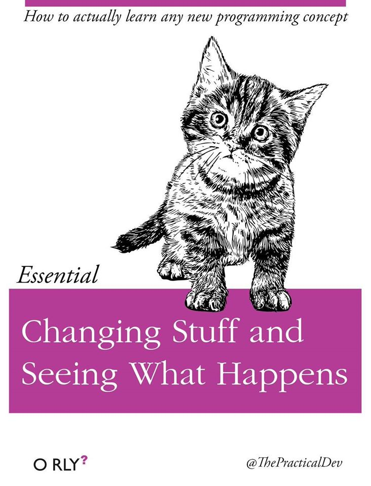
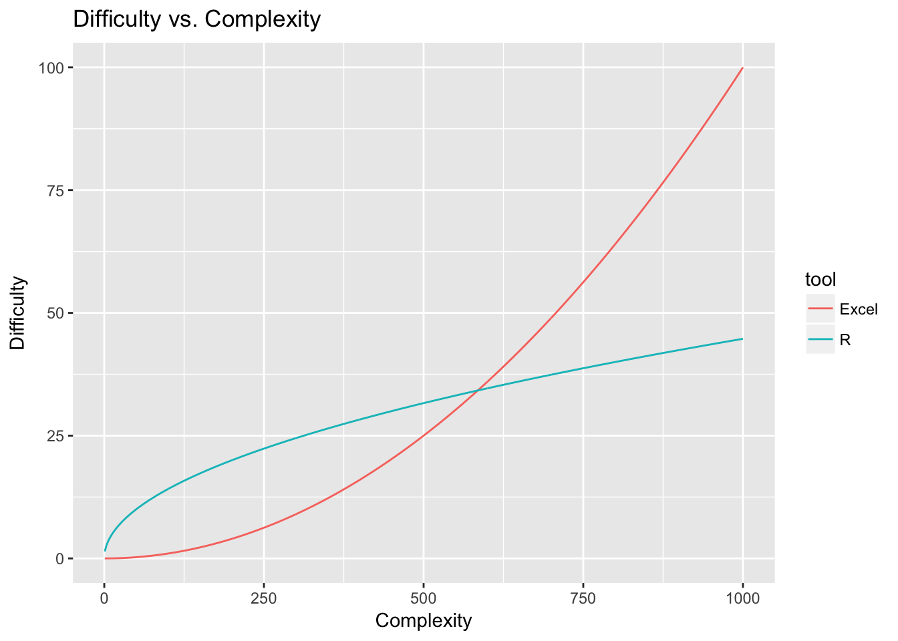
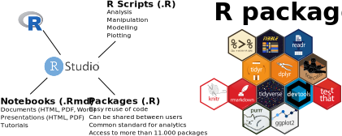
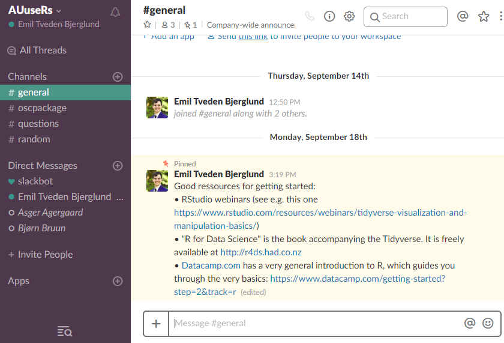

```{r setup, include=FALSE}
knitr::opts_chunk$set(echo = FALSE)
```

<script src="https://use.fontawesome.com/c538300e85.js"></script>
<script src="https://ajax.googleapis.com/ajax/libs/jquery/3.1.1/jquery.min.js"></script>

<script>
  $(document).ready(function() {
    $('slide:not(.backdrop):not(.title-slide)').append('<div class=\"footnotes\">');

    $('footnote').each(function(index) {
      var text  = $(this).html();
      var fnNum = (index+1).toString();
      $(this).html(fnNum.sup());

      var footnote   = fnNum + '. ' + text + '<br/>';
      var oldContent = $(this).parents('slide').children('div.footnotes').html();
      var newContent = oldContent + footnote;
      $(this).parents('slide').children('div.footnotes').html(newContent);
    });
  
    $("#authorfield").html("<i class='fa fa-fw fa-user' aria-hidden='true'></i> Emil Tveden Bjerglund<br><i class='fa fa-fw fa-graduation-cap' aria-hidden='true'></i> PhD-student<br><i class='fa fa-fw fa-university' aria-hidden='true'></i> Aarhus University");
    $("#datefield").html("<i class='fa fa-fw fa-calendar' aria-hidden='true'></i>");
  });
</script>

## R introduction


* R is a free software environment for statistical computing and graphics.
* It runs on a wide variety of UNIX platforms, Windows and MacOS.
* R is open source and actively developed - lots of free stuff to use
* R is a programming language

```r
x <- 10
y <- x * 2

v <- c(3.14, 2, 90)

data <- tibble(
    x = c(1,2,3,4)
    y = x^2
  )
```

Slides: [emiltb.github.io/intro_R/](https://emiltb.github.io/intro_R/)
<div id="cardholder">
<div id="cardtext">
<i class="fa fa-fw fa-user" aria-hidden="true"></i> Emil Tveden Bjerglund<br>
<i class="fa fa-fw fa-envelope" aria-hidden="true"></i> emilbp@inano.au.dk<br> 
<i class="fa fa-fw fa-globe" aria-hidden="true"></i> [emil.tbjerglund.dk](https://emil.tbjerglund.dk)
</div>
</div>

## How do you learn programming?
<div class="columns-2">




I will point out some good ressources later.
</div>

## R and RStudio
<div style="text-align: center;margin-top:-50px;"></div>

## R formats
* R can be used to output to many different formats
* Write everything in plain text and decide how to share it later

<!---
### Ways of R'ing
* R scripts: Read and transform data, make plots, save functions
* R Markdown: Generate reports, write lab journals incl. analysis, save to HTML, PDF, Word
* R packages: Collect groups of functions for reuse
--->
<div style="text-align: center;"></div>


## Examples | R script for general analysis

Loading and plotting UV-Vis data (see `examples/R_simple_example.R`)
```r
library(tidyverse)

path = "data/"

data <- tibble(files = list.files(path, pattern = "*.csv")) %>% 
  mutate(data = map(paste0(path,files), read_delim, delim = ";", skip = 1))
```

## Examples | Lab journal in R Markdown
<div style="text-align: center;margin-top:-50px;">
[emiltb.github.io/graphene-production/](https://emiltb.github.io/graphene-production/lab_journal.html)
</div>


## Examples | R packages for reusing code

* The Comprensive R Archive Network (CRAN) has more than 11.000 packages
* Even more packages in development on Github

* We can make our own package for the group (https://github.com/SPOMAN/osc)
    * Shared functions for loading data (electrochemistry, XPS, Raman etc.)
    * Plots with a unified look
    * Easier collaboration by keeping data and scripts in a common place
    * Easy to install for everyone
    
```r
devtools::install_github('spoman/osc')
```

## Questions and discussion

How does this fit into your work and could you see yourself working with this?

## What should we study

How should we organize the study group so that everyone can benefit?

**Topics**

*	Loading and cleaning data
*	Plotting using ggplot2
*	Reusing code in a package

## Communication
When working with R you might quickly end up having brief questions for other people – where to ask those?

### We could use Slack! http://bit.ly/2ysN7F5
<div style="text-align: center;"></div>


## Getting started with R on your own computer
We can try to install R and RStudio and do some basic examples. 

* Download R: R-project.org > Download > Choose a Mirror > Choose your OS
* Download RStudio: rstudio.com > Download Free RStudio Desktop > Find your OS
* Install both and once you have RStudio open, try to run a few commands.

```r
x <- seq(1, 100, by = 1)
y <- x^2
plot(x,y)
```

* Install the package `tidyverse`

Also - the link to Slack: http://bit.ly/2ysN7F5
